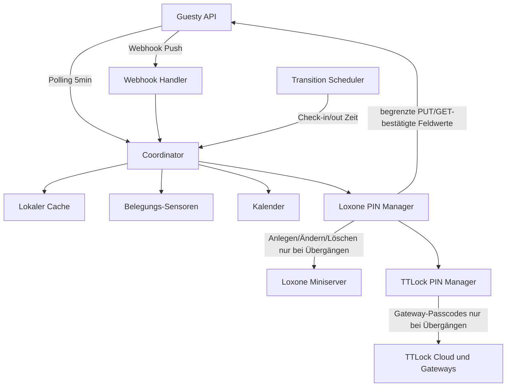

# Guesty Home Assistant Integration

Home Assistant Custom Component zur Anbindung der [Guesty Open API](https://open-api-docs.guesty.com/). Importiert alle Listings als Belegungs-Sensoren und Kalender für Automationen.

## Features

- **Automatischer Import aller Listings** – jedes Listing wird als Sensor und Kalender angelegt
- **Belegungs-Sensor pro Listing** – Status `vacant` (frei) oder `occupied` (vermietet)
- **Punktgenaue Check-in/out Updates** – zeitgesteuerte Neuberechnung ohne API-Polling
- **Guesty Webhooks** – gebündelte Echtzeit-Updates bei Reservierungs- und Listing-Änderungen
- **Signierte Webhooks** – eingehende Ereignisse werden mit Guestys Signatur
  geprüft; Duplikate und veraltete Zustellungen werden verworfen
- **Inkrementeller Sync** – nur geänderte Reservierungen + täglicher Vollabgleich
- **Traffic-sparsame Listing-Synchronisierung** – Listing-Payloads werden direkt verarbeitet; neue Listings laden nur ihre eigenen Reservierungen
- **Individuelle Check-in/Check-out Zeiten** – inkl. UTC-Fallback
- **Kalender pro Listing** – nutzbar in Automationen
- **Lokaler Cache mit Staleness-Erkennung** – transparent bei API-Ausfällen
- **Sync-Status-Sensor** – Diagnose der Integration
- **Custom Event** – `guesty_occupancy_changed` für Automationen
- **Diagnostics** – exportierbar über Home Assistant
- **API Retries** – exponentielles Backoff bei temporären Fehlern
- **Datenschutzmodus** – Gastnamen und Bestätigungscodes sind standardmäßig verborgen
- **Sicherer Gast-Türzugang** – ein zeitlich begrenzter Link pro Reservierung mit
  bis zu sechs serverseitig zugeordneten Home-Assistant-Schlössern und
  automatischer Browser-Sprache (Deutsch, Englisch, Spanisch oder Französisch)
- **Zugangslink-Diagnose pro Listing** – zeigt Link und Guesty-Syncstatus ohne
  den sensiblen Link in der Recorder-Historie zu speichern
- **Loxone Reservierungs-PINs** – sechsstelliger Code in einem konfigurierbaren
  Guesty-Reservierungs-Custom-Field und kurzlebige Loxone-Benutzer mit
  listingabhängigen Gruppen
- **TTLock Reservierungs-PINs** – derselbe Guesty-Code wird optional und
  zeitlich begrenzt auf bis zu sechs gatewayfähige TTLock-Schlösser pro Listing
  übertragen

## Voraussetzungen

- Home Assistant 2025.12 oder neuer
- Guesty Open API Zugang (Client ID + Client Secret)
- Für Webhooks: erreichbare externe Home Assistant URL (z. B. Nabu Casa)
- Für Gast-Türzugang: eine in Home Assistant eingetragene externe **HTTPS**-URL;
  HTTP wird aus Sicherheitsgründen abgelehnt
- Für Loxone-PINs: ein per **HTTPS** erreichbarer Miniserver (direkt oder über
  einen Reverse Proxy) und ein eigenes Loxone-Dienstkonto mit dem Recht
  **Benutzerverwaltung**
- Für TTLock-PINs: eine TTLock-Open-Platform-Anwendung, ein TTLock-App-Konto mit
  Verwaltungsrecht für die Schlösser sowie V4-Schlösser mit Online-Gateway

### API-Schlüssel erstellen

1. In Guesty einloggen
2. **Integrations** → **API & Webhooks**
3. Neue Application erstellen
4. **Client ID** und **Client Secret** sichern (Secret wird nur einmal angezeigt)

## Installation

### Über HACS (empfohlen)

1. HACS installieren (falls noch nicht vorhanden)
2. **HACS** → **Integrations** → **⋮** → **Custom repositories**
3. Repository-URL hinzufügen: `https://github.com/SVENS0Nb/Guesty-HA-Plugin`
4. Kategorie: **Integration**
5. **Guesty** suchen und installieren
6. Home Assistant neu starten

### Manuell

1. `custom_components/guesty` in dein Home Assistant `config/custom_components/` Verzeichnis kopieren
2. Home Assistant neu starten

## Einrichtung

1. **Einstellungen** → **Geräte & Dienste** → **Integration hinzufügen**
2. Nach **Guesty** suchen
3. **Client ID** und **Client Secret** eingeben
4. Optional: Aktualisierungsintervall anpassen (Standard: 300 Sekunden)

### Optionen

Über **Konfigurieren** auf der Integration:

| Option | Standard | Beschreibung |
|--------|----------|--------------|
| Reservierungs-Sync | 300 s | Wie oft Reservierungen abgeglichen werden |
| Listing-Sync | 86400 s | Sicherheitsabgleich bei aktiven Webhooks; ohne Webhook automatisch spätestens alle 15 Minuten |
| Vergangene Tage | 30 | Reservierungsfenster in die Vergangenheit |
| Zukünftige Tage | 365 | Reservierungsfenster in die Zukunft |
| Stale-Schwellenwert | 6 h | Ab wann Daten als veraltet gelten |
| Gastdetails anzeigen | Aus | Gastname und Bestätigungscode in Entitäten anzeigen; sensible Attribute werden nicht im Recorder gespeichert |
| Sicherer Gast-Türzugang | Aus | Erst nach weiterer Konfiguration werden Reservierungslinks erzeugt |
| Loxone Reservierungs-PINs | Aus | Erzeugt Codes im konfigurierten Guesty-Reservierungs-Custom-Field und zeitlich begrenzte Loxone-Benutzer |
| TTLock Reservierungs-PINs | Aus | Überträgt denselben Guesty-Code zeitlich begrenzt auf zugeordnete TTLock-Schlösser |
| Logo-URL | Leer | Optionales Logo oberhalb des Türportals; direkte HTTPS-Bild-URL |
| Favicon-URL | Leer | Optionales Browser-Icon des Türportals; direkte HTTPS-Bild-URL |

## Zeitlich begrenzter Gast-Türzugang

Die Integration kann pro Guesty-Listing ein bis sechs vorhandene
Home-Assistant-Entitäten aus der Domain `lock` zuordnen. Das erste Schloss ist
erforderlich, die weiteren fünf sind optional. Nicht ausgewählte Schlösser
erscheinen nicht auf der Gastseite. Für jede aktive Reservierung wird **ein**
geschützter Link erzeugt. Auf der Seite erscheinen Schaltflächen wie „Haustür
öffnen“ oder „Wohnungstür öffnen“. Die Seite richtet
sich automatisch nach der bevorzugten Browser-/Systemsprache; Deutsch,
Englisch, Spanisch und Französisch werden unterstützt, alle anderen Sprachen
verwenden Englisch. Für jedes Schloss können in den Integrationsoptionen eigene
Bezeichnungen in allen vier Sprachen hinterlegt werden. Bekannte allgemeine
Namen wie „Haustür“ und „Wohnungstür“ erhalten lokale Übersetzungsvorschläge.
Unbekannte individuelle Namen bleiben als sicherer Fallback unverändert; es
werden keine Namen an einen externen Übersetzungsdienst übertragen.

Ein Aufruf des Links per `GET` öffnet niemals eine Tür. Erst eine kleine,
CSRF-geschützte `POST`-Anfrage nach einem bewussten Tastendruck kann
`lock.unlock` auslösen. Dabei werden Reservierungsstatus, Listing-Zuordnung,
Zeitfenster und Schlosszuordnung erneut serverseitig geprüft. Der Browser kann
keine beliebige Entity-ID übergeben. Eine erfolgreiche Aktion zeigt fünf
Sekunden lang eine kleine Bestätigung. Die Schloss-Schaltflächen bleiben
sichtbar und können anschließend ohne Neuladen erneut verwendet werden. Ein
abgelaufenes Aktions-Nonce wird erst beim nächsten Tastendruck erneuert und
einmal automatisch wiederholt; dadurch entsteht kein regelmäßiger
Hintergrund-Traffic.
Vor oder nach dem erlaubten Zeitraum erklärt die Seite in der erkannten Sprache,
dass sie nur im Buchungszeitraum verfügbar ist, ohne Reservierungsdetails
preiszugeben.

### Einrichtung

1. In Guesty unter **Operations → Portfolio → Custom fields → Reservations**
   ein Feld vom Typ **Text** anlegen, zum Beispiel `Door access link`.
2. Der Guesty-API-Anwendung Leserechte für Account-Custom-Fields sowie
   Schreibrechte für Reservierungs-Custom-Fields geben.
3. In Home Assistant bei der Guesty-Integration **Konfigurieren** öffnen und
   **Sicheren Gast-Türzugang** aktivieren.
4. Name oder ID des Custom Fields angeben. Der Standardname
   `Door access link` wird automatisch über die Guesty API aufgelöst.
5. Optional eine direkte HTTPS-URL für ein Logo und ein Favicon eintragen. Das
   Logo wird zentriert und responsiv mit maximal 96 px Höhe dargestellt.
6. Listings auswählen und jedem Listing bis zu sechs `lock.*`-Entitäten sowie
   gastfreundliche Türnamen auf Deutsch, Englisch, Spanisch und Französisch
   zuordnen. Nur das erste Schloss ist erforderlich. Die weiteren Türnamen sind
   als „Wohnungstür“ vorbelegt, werden ohne ausgewählte Schloss-Entität aber
   ignoriert. Die vorgeschlagenen Übersetzungen können frei angepasst werden.
7. Optional eine Freigabe vor Check-in oder nach Check-out einstellen.
8. In Guesty die erzeugte Custom-Field-Variable, zum Beispiel
   `{{door_access_link}}`, im Guest-App-Check-in-Text oder in einer
   automatisierten Nachricht verwenden.

Das Custom Field enthält ausschließlich die URL, damit Guesty sie als Link
darstellen kann. Die Integration verwendet dafür den aktuellen Guesty-v3-
Endpunkt für Reservierungs-Custom-Fields.

### Lebenszyklus und Ausfallsicherheit

- Bestätigte Reservierung: Token und Guesty-Link werden erzeugt.
- Datum, Listing oder Schlosszuordnung geändert: Der alte Token wird sofort
  ungültig und ein neuer Link wird veröffentlicht.
- Gelöschtes oder neu angelegtes Custom Field: Die gespeicherte Feld-ID wird
  nach einem Neustart neu geprüft. Nur wenn Guesty eindeutig eine ungültige
  Feldreferenz meldet und die neu aufgelöste ID wirklich abweicht, macht die
  Integration den alten Link ungültig und veröffentlicht genau einmal einen
  neuen. Timeouts, Rate-Limits und Serverfehler verändern den Link nicht.
- Stornierung, Löschung, Check-out oder deaktivierte Funktion: Der Zugriff wird
  zuerst lokal gesperrt; anschließend wird das Guesty-Feld gelöscht.
- Ein einzelner fehlgeschlagener Guesty-Poll sperrt einen bereits bestätigten
  Gastlink nicht sofort. Erst wenn der letzte bestätigte Reservierungsstand den
  konfigurierten Stale-Schwellenwert überschreitet, arbeitet der Türzugang
  „fail closed“ und verweigert die Öffnung.
- Unveränderte Reservierungen erzeugen keine weiteren Guesty-Schreibzugriffe.
- Neue Links werden pro Abgleich in kleinen Batches veröffentlicht. Dadurch
  bleibt auch bei vielen zukünftigen Reservierungen API-Kapazität für den
  normalen Buchungs- und Webhook-Abgleich frei.
- Fehlgeschlagene Veröffentlichungs- und Löschvorgänge verwenden ein
  persistentes exponentielles Backoff. Dadurch erzeugen Guesty-Ausfälle keine
  Schreibschleife; lokal widerrufene Links bleiben dabei sofort gesperrt.
- Nicht mehr benötigte lokale Zugangsdatensätze werden nach erfolgreicher
  Bereinigung entfernt. Nicht bereinigbare Tombstones laufen nach sieben Tagen
  aus; ihre alten Links bleiben durch die lokale Token-Prüfung ungültig.
- „Synchronisiert“ wird erst gemeldet, nachdem der Wert über Guestys separaten
  Reservation-Custom-Field-GET-Endpunkt zurückgelesen wurde. Kurz verzögerte
  Guesty-Antworten werden begrenzt erneut geprüft.

### Reverse-Proxy-Sicherheit

- `/api/guesty/access/` muss `GET` und `POST` unverändert an Home Assistant
  weiterleiten und darf nicht gecacht werden.
- Für diesen Pfad keine zusätzliche Login-Seite des Reverse Proxys erzwingen;
  der lange Zufallstoken, das kurze Aktions-Nonce und die Zeitprüfung übernehmen
  die Gastautorisierung.
- Der Reservierungstoken steht in der URL. Access-Logs des Reverse Proxys für
  `/api/guesty/access/` deshalb deaktivieren oder den Pfad redigieren.
- TLS, korrekte `X-Forwarded-Proto`-/Host-Header und Home Assistants
  `trusted_proxies` korrekt konfigurieren.
- Logo und Favicon werden vom Browser direkt von den eingetragenen Hosts
  geladen. Für bestmöglichen Datenschutz die Bilder auf der eigenen
  HTTPS-Domain bereitstellen. Die Seite übermittelt dabei keinen Referrer.

Zusätzliche Schutzmaßnahmen sind ein 5-Sekunden-Cooldown, maximal zehn gültige
Aktionen pro Minute und Schloss, restriktive Browser-Header sowie das lokale
Event `guesty_door_access`. Das Event enthält Reservierungs-ID, Listing-ID,
Schloss-Entity und Ergebnis, aber weder Gastnamen noch Zugriffstoken.

## Loxone Reservierungs-PINs

Optional kann die Integration zusätzlich für jede aktive Guesty-Reservierung
einen sechsstelligen Zahlencode verwalten. Der Code wird beim ersten Erkennen
der Reservierung erzeugt und in ein frei konfigurierbares
**Reservierungs-Custom-Field** geschrieben. Standardmäßig erwartet die
Integration die Variable `{{door_code}}`. Der Name, die Variable mit oder ohne
doppelte geschweifte Klammern oder die interne 24-stellige Feld-ID können in den
Home-Assistant-Optionen eingetragen und später geändert werden. In Guesty Guest
App und Nachrichten wird die von Guesty angezeigte Variable des Feldes
verwendet.

Die Funktion prüft keinen Zahlungsstatus. Sie arbeitet mit denselben aktiven
Reservierungsstatus wie Kalender und Türlink (`confirmed`, `reserved`,
`checked_in` und entsprechende Guesty-Varianten). Dadurch wird der Code auch
für eine zukünftige Reservierung unmittelbar nach Webhook oder spätestens beim
nächsten normalen Reservierungsabgleich erzeugt. Der gemeinsame Guesty-Client,
OAuth-Token, Webhook, Reservierungs-Cache und 5-Minuten-Abgleich werden
wiederverwendet; es gibt keinen zweiten Poller. Die Custom-Field-Werte werden
nach Möglichkeit direkt aus demselben Reservierungsabruf übernommen. Nur wenn
Guesty sie dort nicht liefert, erfolgt ein gezielter Lesezugriff für die
betroffene Reservierung. Pro neuem Code entsteht ein verifizierter
Guesty-Schreibzugriff.

Der Loxone-Benutzer wird dagegen erst kurz vor dem erlaubten Zeitraum angelegt.
Standardmäßig beträgt der Vorlauf sechs Stunden. Seine Gültigkeit ist:

```text
Beginn = Check-in − „Zugang vor Check-in"
Ende   = Check-out + „Zugang nach Check-out"
```

Der Benutzer erhält `userState=4`, die ausgewählten Benutzergruppen und – bei
aktuellen Miniservern – `expirationAction=1` zur automatischen Löschung. Die
Integration löscht ihn am Ende zusätzlich selbst. So füllen weit entfernte
Buchungen die Loxone-Benutzerdatenbank nicht.

### Einrichtung

#### 1. Türen und Berechtigungen in Loxone Config vorbereiten

1. Den NFC Code Touch beziehungsweise den verwendeten Loxone-
   Authentifizierungsbaustein vollständig einrichten und dessen Ausgang mit der
   tatsächlichen Türöffnung verbinden. Die Integration verwaltet nur Benutzer,
   Zeitraum, Gruppen und Zugangscode; sie programmiert keine Relais- oder
   Türlogik.
2. Unter **Benutzerverwaltung** für jeden benötigten Zugriffsbereich eine
   normale Gruppe anlegen, zum Beispiel `Gäste Haus`, `Gäste Wohnung 1` oder
   `Gäste Haupteingang + Wohnung 1`.
3. Für jede Gruppe über **Berechtigungen verwalten → Zugang** ausschließlich
   die NFC Code Touches beziehungsweise Authentifizierungsbausteine freigeben,
   die diese Gruppe öffnen darf. Zusätzlich im jeweiligen NFC-Code-Touch-
   Baustein die passenden Benutzergruppen zulassen. Ein explizites `Verweigern`
   in einer übergeordneten Gruppe überstimmt ein `Erlauben`.
4. Mit einem vorübergehend manuell angelegten Testbenutzer prüfen, dass jede
   Gruppe genau die gewünschten Türen öffnet und keine anderen. Den
   Testbenutzer anschließend wieder löschen.

Loxone beschreibt die Gruppen- und Zugangsrechte in der
[Benutzer- und Rechteverwaltung](https://www.loxone.com/enen/kb/user-and-rights-management/)
und die bausteinbezogene Freigabe in der
[Dokumentation zur NFC-Code-Touch-Authentifizierung](https://www.loxone.com/enus/kb/authentication-nfc-code-touch/).
Benutzerbezogene Codes gelten grundsätzlich projektweit; die tatsächlich
erlaubten Türen müssen deshalb über die Gruppen-/Bausteinrechte begrenzt werden.

#### 2. Loxone-Dienstkonto und Netzwerkzugriff

1. Einen eigenen Loxone-Benutzer nur für Home Assistant anlegen. Nicht das
   normale `admin`-Konto verwenden.
2. Diesem Dienstkonto das allgemeine Recht **Benutzerverwaltung** geben. Es
   benötigt keine Mitgliedschaft in den später ausgewählten Gastgruppen und
   keine Türberechtigung. Ohne Benutzerverwaltungsrecht antwortet die offizielle
   API mit `403`.
3. Ein langes, eigenes Passwort verwenden und die direkte Miniserver- oder
   Reverse-Proxy-Adresse ausschließlich über **HTTPS** bereitstellen.
4. Beim Reverse Proxy den kompletten Pfad `/jdev/sps/`, den
   `Authorization`-Header und URL-kodierte Pfadbestandteile unverändert
   weiterleiten. Benötigt werden insbesondere `getgrouplist`, `checkuserid`,
   `getuser`, `addoredituser`, `updateuseraccesscode` und `deleteuser`.
5. Für `/jdev/sps/` Caching deaktivieren und Zugriff-Logs ausblenden oder
   redigieren. Die offizielle Loxone-Schnittstelle überträgt den neuen PIN im
   HTTPS-Pfad. Details und Rückgabecodes stehen in Loxones
   [Usermanagement-API-Dokument](https://www.loxone.com/enen/wp-content/uploads/sites/3/2026/04/1700_Usermanagement.pdf).

#### 3. Guesty vorbereiten

1. Unter **Operations → Portfolio → Custom fields → Reservations** ein
   Reservierungs-Custom-Field vom Typ **Text** anlegen, zum Beispiel `Door
   code`. Das Feld darf nicht als Property-Custom-Field angelegt werden.
2. Die in Guesty angezeigte Variable notieren. Bei der hier beschriebenen
   Einrichtung ist das `{{door_code}}`.
3. Der Guesty-Open-API-Anwendung Lese- und Schreibzugriff auf Reservierungen und
   Reservierungs-Custom-Fields geben.
4. In der Guest App beziehungsweise Nachrichtenvorlage genau die von Guesty
   angezeigte Variable verwenden. Der kostenpflichtige Guesty Locks Manager ist
   dafür nicht erforderlich.

#### 4. Integration in Home Assistant konfigurieren

1. **Einstellungen → Geräte & Dienste → Guesty → Konfigurieren → Loxone
   Reservierungs-PINs** öffnen und die Funktion aktivieren.
2. Unter **Guesty-Reservierungsfeld für den Türcode (Name, Variable oder ID)**
   wahlweise `Door Code`, `door_code`, `{{door_code}}` oder die interne Feld-ID
   eintragen. Das Feld für den Türlink akzeptiert dieselben Referenzarten. Wird
   später ein anderes Feld gewählt, übernimmt
   ein leeres Zielfeld den vorhandenen Code ohne Rotation; ein bereits
   ausgefülltes Zielfeld bleibt als neue maßgebliche Quelle erhalten.
3. Den Vorlauf festlegen. Erst so viele Minuten vor dem erlaubten Zugangsbeginn
   wird der Loxone-Benutzer angelegt. Weit entfernte Buchungen belegen dadurch
   keinen Platz in der Loxone-Benutzerdatenbank.
4. Einen reservierten PIN-Präfix mit ein oder zwei Ziffern wählen, standardmäßig
   `7`. Damit bleiben mindestens 10.000 automatisch nutzbare Codes für alle
   Listings und zukünftigen Buchungen gemeinsam verfügbar. Automatisch erzeugte
   und wegen Kollision ersetzte Codes verwenden diesen Präfix. Manuell in Guesty
   gesetzte, eindeutige sechsstellige Codes dürfen davon abweichen.
5. Nur die Listings auswählen, die tatsächlich Loxone verwenden. Nicht
   ausgewählte Listings erhalten weder einen automatisch erzeugten Code noch
   einen Loxone-Benutzer.
6. Anzahl der Miniserver angeben und pro Server Anzeigename, HTTPS-URL,
   Dienstkonto und Passwort eintragen. Beim Bestätigen prüft die Integration die
   Verbindung und lädt die zulässigen normalen Benutzergruppen.
7. Jedem ausgewählten Guesty-Listing eine oder mehrere Gruppen von genau einem
   Miniserver zuordnen. Die gewählten Gruppen bestimmen vollständig, welche
   Türen der Buchungscode öffnen darf. Die Integration blendet eingebaute,
   administrative sowie Gruppen mit Loxone-Config- oder
   Benutzerverwaltungsrechten grundsätzlich aus.
8. Optional pro Listing unter **Taste hinter dem Guesty-Code** die am Tastenfeld
   erforderliche Bestätigung eintragen, zum Beispiel `#`, `*` oder `☑️`.
   Guesty zeigt dann beispielsweise `723456#`. Loxone und TTLock erhalten
   weiterhin ausschließlich den numerischen PIN `723456`. Das Feld akzeptiert
   bis zu acht Zeichen ohne Ziffern; bleibt es leer, zeigt Guesty nur den PIN.
   Nutzt dasselbe Listing Loxone und TTLock mit unterschiedlichen
   Bestätigungstasten, kann ein gemeinsamer Hinweis wie `☑️ / #` verwendet
   werden. Die Einstellung erscheint dann nur einmal und kann vom zweiten
   Anbieter nicht überschrieben werden.

#### 5. Funktion prüfen

1. Eine zukünftige Testreservierung anlegen. Kurz nach Webhook beziehungsweise
   spätestens nach dem normalen Abgleich muss Guesty im Reservierungs-Custom-
   Field `{{door_code}}` einen sechsstelligen Wert anzeigen. Bei der erstmaligen
   Aktivierung mit vielen vorhandenen Reservierungen werden aktuelle und nahe
   Buchungen zuerst und danach jeweils höchstens zwei weitere Feldwerte pro
   Durchlauf geschrieben. Der nächste Teil der Warteschlange folgt automatisch
   nach etwa 30 Sekunden; dadurch bleibt Guestys API auch während der Migration
   für normale Reservierungsabgleiche verfügbar.
2. Der Sensor **Guesty-Code-Status** muss `Synchronisiert` anzeigen. Vor dem
   eingestellten Loxone-Vorlauf zeigt **Loxone-PIN-Status** zunächst `Geplant`.
3. Innerhalb des Vorlaufs muss in Loxone ein zeitlich begrenzter Benutzer mit
   der richtigen Buchungs-ID beziehungsweise – bei aktivierten Gastdetails –
   dem Gastnamen und den ausgewählten Gruppen erscheinen. Der Loxone-Sensor
   wechselt dann zu `Bereitgestellt`.
4. Code am NFC Code Touch innerhalb des Zugangszeitraums testen. Vor Beginn und
   nach Ende darf er nicht funktionieren. Nach Checkout muss der automatisch
   verwaltete Benutzer wieder aus Loxone verschwinden.

HTTP-URLs und Zugangsdaten innerhalb der URL werden von der Integration
abgelehnt.

### Lebenszyklus und Sicherheit

- Existiert bereits ein gültiger sechsstelliger Code im konfigurierten
  Guesty-Custom-Field, wird er übernommen. Andernfalls wird kryptografisch
  zufällig ein Code im reservierten Präfixbereich erzeugt. Beim ersten Wechsel
  von der früheren Keycode-Implementierung wird ein bereits gespeicherter Code
  ohne Rotation in ein leeres Custom Field übernommen.
- Ein gültiger, eindeutiger sechsstelliger Code im Guesty-Custom-Field ist die
  maßgebliche Quelle. Manuelle Änderungen werden nach dem Reservierungs-Webhook
  beziehungsweise dem nächsten Abgleich übernommen und auch bei einem bereits
  existierenden Loxone-Benutzer aktualisiert. Wird das Feld ausdrücklich
  geleert oder enthält es einen ungültigen Wert, wird ein eventuell vorhandener
  Loxone-Benutzer zuerst entfernt und anschließend ein neuer gültiger Code in
  Guesty erzeugt.
- Ein konfigurierter Bestätigungszusatz gehört nur zur Guesty-Anzeige und nie
  zum eigentlichen Zugangscode. Beim Lesen trennt die Integration einen kurzen
  nichtnumerischen Zusatz sicher vom sechsstelligen PIN. Wird der Zusatz in den
  Optionen geändert, schreibt sie bestehende aktive Reservierungen mit dem
  neuen Anzeigeformat neu, ohne den PIN in Loxone oder TTLock zu ändern.
- Wird ein manuell eingetragener Code bereits von einer anderen bekannten
  aktiven Guesty-Buchung verwendet, behält die bisherige Buchung ihren Code. Die
  Buchung mit dem duplizierten Eintrag erhält einen neuen Zufallscode, der
  zuerst nach Guesty und anschließend nach Loxone geschrieben wird.
- Eine Kollision mit einem ausschließlich in Loxone vorhandenen Code kann die
  Loxone-API erst beim tatsächlichen Zuweisen erkennen. Bei zukünftigen
  Buchungen erfolgt diese Prüfung daher erst innerhalb des konfigurierten
  Loxone-Vorlaufs; ein nötiger Ersatz erscheint dann automatisch in Guesty.
- Änderungen an Gastname, Zeitraum oder Gruppen aktualisieren den bestehenden
  Loxone-Benutzer. Wird eine bereits bereitgestellte Buchung so weit in die
  Zukunft verschoben, dass sie wieder außerhalb des Vorlaufs liegt, wird der
  bisherige Benutzer sofort entfernt und erst im neuen Vorlauf mit demselben
  Guesty-Code neu angelegt. Bei einem Listing-/Miniserver-Wechsel wird zuerst
  der alte Benutzer entfernt und der aktuelle Guesty-Code am Ziel neu
  bereitgestellt.
- Wird die Custom-Field-Referenz in den Integrationsoptionen geändert, löst die
  Integration das neue Feld erneut zur internen Guesty-ID auf. Ein vorhandener
  Wert im neuen Feld gewinnt; ist das Feld leer, wird der bisherige Code
  übernommen. Dadurch ändert ein reiner Konfigurationswechsel keinen Gastcode.
- Ist „Gastdetails anzeigen“ deaktiviert, verwendet der Loxone-Benutzer die
  Guesty-Buchungs-ID statt des Gastnamens. Nur nach ausdrücklicher Aktivierung
  wird der Name an Loxone übermittelt.
- Storno oder Zugangsende entfernen zuerst den Klartextcode aus dem privaten
  Home-Assistant-Speicher und danach den Loxone-Benutzer. Das Guesty-Custom-
  Field bleibt zur Buchungsdokumentation erhalten; der allgemeine Guesty-Cache
  speichert Codes ausdrücklich nicht dauerhaft.
- Loxones Ergebnisse `201` (nicht eindeutig) und `409` (bereits in einem
  NFC-Authentifizierungsbaustein verwendet) werden niemals als Erfolg
  akzeptiert. Der möglicherweise angelegte Benutzer wird sofort entfernt, der
  abgelehnte Code ausgeschlossen und ein neuer Code erzeugt. Erst nachdem
  Guesty den Ersatz bestätigt hat, wird die Loxone-Bereitstellung erneut
  versucht. Pro Abgleich sind höchstens drei automatische Rotationen erlaubt;
  danach greift das normale exponentielle Backoff. So entstehen weder
  Endlosschleifen noch unkontrollierter API-Traffic.
- Bei veralteten Guesty-Daten werden keine neuen Loxone-Benutzer angelegt oder
  Codes erzeugt. Bereits bekannte Benutzer werden am fest gespeicherten
  Zugangsende trotzdem entfernt. API-Fehler verwenden persistentes,
  begrenztes Backoff statt einer Anfrageschleife.
- Guesty-Schreibfehler werden am Sensor **Guesty-Code-Status** als `Fehler`
  ausgegeben. Das Attribut `error_reason` unterscheidet unter anderem fehlende
  Berechtigungen, Authentifizierungsfehler und vorübergehende API-Probleme,
  ohne Reservierungsdaten oder API-Antworttexte offenzulegen. Eine planmäßig
  wartende Migration bleibt `Ausstehend` und wird nicht als Fehler behandelt.
- Loxone-Zugangsdaten, PINs und Gastnamen erscheinen nicht in Home-Assistant-
  Diagnosedaten. Die Miniserver-Passwörter liegen – wie andere
  Integrations-Zugangsdaten – im Config-Entry-Speicher. Solange ein verwalteter
  Benutzer existiert, wird zusätzlich ein privater Verbindungs-Snapshot ohne
  Gruppen- oder Gastdaten gehalten, damit er auch nach einer URL- oder
  Kontoumstellung noch auf dem alten Miniserver gelöscht werden kann.

## TTLock Reservierungs-PINs

TTLock ist ein eigener, optionaler Zielanbieter und kann unabhängig von Loxone
oder zusammen mit Loxone aktiviert werden. Die Integration verwendet dabei
dieselbe Reservierung, dasselbe Guesty-Custom-Field und denselben sechsstelligen
Code. Es entsteht kein zweiter Guesty-Poller: Webhooks, Reservierungs-Cache,
OAuth-Token und regulärer Abgleich werden gemeinsam genutzt.

Der Code wird unmittelbar nach dem Erkennen einer aktiven Reservierung in
Guesty angelegt. Auf den TTLock-Schlössern erscheint er erst innerhalb des
konfigurierten Bereitstellungsvorlaufs. Seine Gültigkeit entspricht exakt den
bereits verwendeten Zugangsgrenzen:

```text
Beginn = Check-in − „Zugang vor Check-in"
Ende   = Check-out + „Zugang nach Check-out"
```

### TTLock vorbereiten und verbinden

1. Im [TTLock Open Platform Portal](https://euopen.ttlock.com/) eine Anwendung
   anlegen und deren Client-ID und Client-Secret bereithalten.
2. Ein TTLock-App-Konto verwenden, das die gewünschten Schlösser verwaltet.
   Das App-Passwort wird beim Einrichten nur zum OAuth-Austausch verwendet und
   nicht gespeichert. Danach arbeitet die Integration mit Access- und
   Refresh-Token.
3. Sicherstellen, dass jedes gewünschte Schloss `keyboardPwdVersion=4` meldet
   und über ein erreichbares Gateway verfügt (`hasGateway=1`). Nur solche
   Schlösser werden in der Auswahl angezeigt.
4. In **Einstellungen → Geräte & Dienste → Guesty → Konfigurieren** die Option
   **TTLock Reservierungs-PINs** einschalten. Region, Open-Platform-Zugang,
   TTLock-App-Benutzer und Passwort eingeben.
5. Das Guesty-Reservierungsfeld, den PIN-Präfix sowie Vor-/Nachlauf festlegen.
   Wenn Loxone ebenfalls aktiv ist, werden diese gemeinsamen Einstellungen in
   beiden Abschnitten identisch verwendet; der zuletzt bestätigte Wert gilt für
   beide Anbieter.
6. Nur die gewünschten Guesty-Listings auswählen und jedem Listing ein bis
   sechs TTLock-Schlösser zuordnen. Ein Schloss darf mehreren Listings
   zugeordnet werden, sofern das zum realen Zutrittskonzept passt.

Die Integration nutzt die offiziellen Gateway-Operationen zum
[Anlegen](https://euopen.ttlock.com/doc/api/v3/keyboardPwd/add),
[Ändern](https://euopen.ttlock.com/doc/api/v3/keyboardPwd/change) und
[Löschen](https://euopen.ttlock.com/doc/api/v3/keyboardPwd/delete) angepasster
V4-Passcodes. Eine direkte Bluetooth-Verbindung von Home Assistant zum Schloss
ist dafür nicht erforderlich.

### Lebenszyklus, Fehlerfälle und Traffic

- Manuelle Codeänderungen im maßgeblichen Guesty-Custom-Field werden beim
  Webhook beziehungsweise nächsten Reservierungsabgleich erkannt. Bereits
  bereitgestellte TTLock-Passcodes werden mit derselben ID aktualisiert.
- Änderungen an Check-in, Check-out oder den Zugangs-Offsets aktualisieren die
  Gültigkeitszeit auf allen zugeordneten Schlössern. Der Code bleibt dabei
  unverändert.
- Stornierung, Zugangsende, entfernte Zuordnung oder deaktivierte TTLock-
  Funktion löschen ausschließlich die von dieser Integration verwalteten
  TTLock-Passcodes. Andere TTLock-Codes bleiben unangetastet.
- Vor jeder Neuanlage wird die Passcodeliste des betroffenen Schlosses geprüft.
  Ist der Guesty-Code dort bereits anderweitig vergeben, erzeugt der gemeinsame
  PIN-Manager einen neuen global eindeutigen Code, bestätigt ihn zuerst in
  Guesty und verteilt ihn anschließend erneut an Loxone und TTLock. TTLock darf
  höchstens drei solcher Codewechsel pro Reservierung und Stunde auslösen;
  weitere Konflikte warten mit Backoff, statt Guesty in einer schnellen
  Schreibschleife zu verändern.
- Bei mehreren Schlössern werden erfolgreiche Einzeloperationen sofort
  gespeichert. Ein ausgefallenes Gateway führt deshalb nicht zur doppelten
  Anlage auf bereits erfolgreichen Schlössern. Der Status lautet bis zur
  vollständigen Zustellung `Teilweise` oder `Gateway offline`.
- Transportfehler, Rate-Limits und Offline-Gateways verwenden ein persistentes,
  begrenztes exponentielles Backoff. Nach einer Netzwerkunterbrechung wird die
  Arbeit automatisch fortgesetzt; es gibt keine schnelle Wiederholungsschleife.
- TTLock wird bei Bereitstellung, Änderung, Löschung und anschließend höchstens
  alle 30 Minuten zur Driftkontrolle abgefragt. Dabei werden Abfragen desselben
  Schlosses innerhalb eines Abgleichs zusammengefasst. So werden manuell
  gelöschte oder veränderte Codes erkannt, ohne bei jedem fünfminütigen Guesty-
  Poll zusätzlichen TTLock-Traffic zu erzeugen. Bei veralteten Guesty-Daten
  werden keine neuen Zugänge angelegt oder erweitert; ein bereits gespeichertes
  Zugangsende wird weiterhin aufgeräumt.
- Vor Änderung oder Löschung muss die TTLock-ID weiterhin den privaten
  Reservierungsmarker tragen. Fremde oder manuell umbenannte Passcodes werden
  niemals anhand einer veralteten lokalen ID verändert. TTLock-Zustände wie
  `adding`, `add failed`, `modify failed` oder `deleting` gelten nicht als
  erfolgreich bereitgestellt und werden gezielt erneut geprüft beziehungsweise
  sicher ersetzt.
- Das nicht idempotente Anlegen eines Passcodes wird bei einem Transportabbruch
  nicht blind wiederholt. Stattdessen sucht die Integration den Vorgang über
  den Reservierungsmarker und verhindert dadurch verwaiste Doppelanlagen.
- Ein datenschutzfreundlicher Marker aus einem Hash der Reservierungs-ID
  ermöglicht nach einer unklaren Netzwerkantwort die Wiedererkennung. Gastname,
  Reservierungs-ID im Klartext, PINs und TTLock-Zugangsdaten erscheinen weder
  im Marker noch in Home-Assistant-Diagnosedaten.

Der Diagnose-Sensor **TTLock-PIN-Status** zeigt je Listing unter anderem
`Geplant`, `Ausstehend`, `Teilweise`, `Bereitgestellt`, `Gateway offline`,
`Konflikt`, `Löschung ausstehend` oder `Fehler`. Er enthält nur Anzahlen und
Zeitpunkte, niemals den sechsstelligen Code.

Für eine Backup-Home-Assistant-Instanz sollte immer nur eine Instanz gleichzeitig
als aktiver Schreiber laufen. Der gemeinsame Guesty-Code bleibt bei einem
bewussten Wechsel erhalten; die neue Instanz kann ihre eigenen TTLock-Einträge
anlegen. Zwei parallel aktive Instanzen könnten dagegen gegenseitige
Kollisionswechsel und unnötigen API-Traffic auslösen.

## Entitäten

**Alle Listings** aus deinem Guesty-Konto werden automatisch importiert. Pro Listing:

| Entität | Beispiel | Beschreibung |
|---------|----------|--------------|
| Sensor | `sensor.ferienwohnung_belegung` | `vacant` oder `occupied` |
| Sensor (standardmäßig deaktiviert) | `sensor.ferienwohnung_aktueller_gast` | Name des Gastes der aktuell laufenden Reservierung |
| Diagnose-Sensor (standardmäßig deaktiviert) | `sensor.ferienwohnung_gast_zugangslink` | Status des aktuellen beziehungsweise nächsten Links; die erzeugte URL steht im Attribut `access_url` |
| Diagnose-Sensor | `sensor.ferienwohnung_guesty_keycode_status` | Guesty-Code-Custom-Field: `Nicht konfiguriert`, `Keine Reservierung`, `Ausstehend`, `Synchronisiert`, `Konflikt` oder `Fehler` |
| Diagnose-Sensor | `sensor.ferienwohnung_loxone_pin_status` | Zeigt zusätzlich `Geplant`, `Bereitgestellt` oder `Löschung ausstehend` für den Loxone-Benutzer |
| Diagnose-Sensor | `sensor.ferienwohnung_ttlock_pin_status` | Zustellung desselben Codes an TTLock, einschließlich Anzahl zugeordneter und bereitgestellter Schlösser |
| Kalender | `calendar.ferienwohnung_reservierungen` | Alle Reservierungen |

Kalendereinträge zeigen standardmäßig nur „Reserviert“ und den Reservierungsstatus. Gastnamen und Bestätigungscodes können in den Integrationsoptionen aktiviert werden.

Der Sensor „Aktueller Gast“ benötigt ebenfalls die Option „Gastdetails anzeigen“ und ist zusätzlich standardmäßig deaktiviert. Nach dem manuellen Aktivieren wird sein Zustand vom Home-Assistant-Recorder gespeichert, sofern die Entität nicht in der Recorder-Konfiguration ausgeschlossen wird.

Der Sensor „Gast-Zugangslink“ ist aus Sicherheitsgründen ebenfalls
standardmäßig deaktiviert. Zum Prüfen unter **Einstellungen → Geräte & Dienste →
Guesty → Gerät des Listings → Entitäten** auch deaktivierte Entitäten anzeigen
und den Sensor aktivieren. Sein Zustand ist `Nicht konfiguriert`, `Keine
Reservierung`, `Ausstehend`, `Synchronisiert` oder `Fehler`. Der aktuelle oder
nächste Link steht in den Entitätsattributen unter `access_url`, zum Beispiel in
**Entwicklerwerkzeuge → Zustände**. `access_url` und der optionale Gastname werden
nicht in der Recorder-Historie gespeichert. Der Link ist dennoch ein
Zugangsschlüssel und darf nicht öffentlich geteilt oder in Dashboards für andere
Benutzer angezeigt werden.

Zusätzlich ein Integrations-Sensor:

| Entität | Beschreibung |
|---------|--------------|
| `sensor.guesty_sync_status` | `ok`, `degraded` oder `error` |

### Nicht benötigte Entitäten deaktivieren

1. **Einstellungen** → **Geräte & Dienste** → **Entitäten**
2. Nach Listing-Namen filtern
3. Entität deaktivieren

## Automationen

### Über Custom Event (empfohlen für Echtzeit)

```yaml
trigger:
  - platform: event
    event_type: guesty_occupancy_changed
    event_data:
      to: occupied
action:
  - service: notify.mobile_app
    data:
      message: "{{ trigger.event.data.listing_name }} ist jetzt belegt"
```

### Bei Check-out aufräumen

```yaml
trigger:
  - platform: state
    entity_id: sensor.ferienwohnung_belegung
    from: occupied
    to: vacant
action:
  - service: vacuum.start
    target:
      entity_id: vacuum.roborock
```

### Vor Check-in heizen

```yaml
trigger:
  - platform: calendar
    entity_id: calendar.ferienwohnung_reservierungen
    event: start
    offset: "-02:00:00"
action:
  - service: climate.set_temperature
    target:
      entity_id: climate.wohnzimmer
    data:
      temperature: 21
```

## Sync-Architektur



1. **Polling** – inkrementeller Reservierungsabgleich alle 5 Minuten; verpasste Listing-Events werden ohne aktiven Webhook spätestens nach 15 Minuten erkannt
2. **Webhooks** – Guestys aktuelle Reservierungsereignisse
   `reservation.created.v2` und `reservation.updated.v2` werden nach einer
   kurzen 0,75-s-Sammelphase verarbeitet. Die Integration prüft die von Guesty
   bereitgestellte HMAC-Signatur; Duplikate und Ereignis-Bursts erzeugen dadurch
   möglichst wenige API-Aufrufe. Bestehende Abonnements ohne Signatur-Secret
   werden einmalig sicher neu erstellt; schlägt auch danach der Secret-Abruf
   fehl, bleibt der Polling-Fallback aktiv, ohne eine Neuanlage-Schleife.
3. **Scheduler** – Belegung wechselt punktgenau bei Check-in/out
4. **Täglicher Vollsync** – verhindert Drift im Cache

## Belegungslogik

Check-in/out Zeiten in dieser Priorität:

1. UTC-Felder `checkIn` / `checkOut` (wenn vorhanden)
2. `plannedArrival` / `plannedDeparture`
3. Listing-Defaults
4. Fallback: 15:00 / 11:00

## Tests

```bash
python -m pip install -r requirements-test.txt
python -m pytest
```

## Fehlerbehebung

- **Webhook nicht aktiv** – externe URL in Home Assistant konfigurieren (Einstellungen → System → Netzwerk)
- **Sync-Status `degraded`** – API temporär nicht erreichbar, Cache wird genutzt
- **Guesty-Feld bleibt leer** – den deaktivierten Diagnose-Sensor
  „Gast-Zugangslink“ aktivieren: `Synchronisiert` mit `access_url` bestätigt die
  lokale Erzeugung und den von Guesty bestätigten Schreibvorgang; `Ausstehend`
  oder `Fehler` zeigt, dass die Veröffentlichung noch nicht bestätigt ist
- **Diagnostics** – Integration → ⋮ → Diagnose-Daten herunterladen
- **Logs** – `logger: custom_components.guesty: debug` in `configuration.yaml`

## Lizenz

MIT
