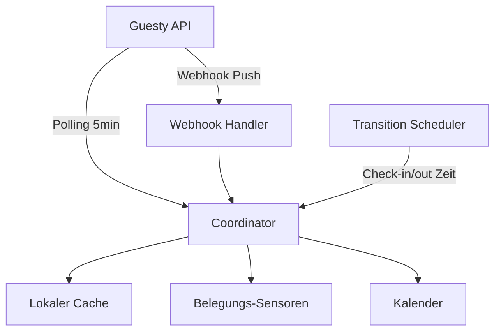

# Guesty Home Assistant Integration

Home Assistant Custom Component zur Anbindung der [Guesty Open API](https://open-api-docs.guesty.com/). Importiert alle Listings als Belegungs-Sensoren und Kalender für Automationen.

## Features

- **Automatischer Import aller Listings** – jedes Listing wird als Sensor und Kalender angelegt
- **Belegungs-Sensor pro Listing** – Status `vacant` (frei) oder `occupied` (vermietet)
- **Punktgenaue Check-in/out Updates** – zeitgesteuerte Neuberechnung ohne API-Polling
- **Guesty Webhooks** – gebündelte Echtzeit-Updates bei Reservierungs- und Listing-Änderungen
- **Inkrementeller Sync** – nur geänderte Reservierungen + täglicher Vollabgleich
- **Traffic-sparsame Listing-Synchronisierung** – Listing-Payloads werden direkt verarbeitet; neue Listings laden nur ihre eigenen Reservierungen
- **Individuelle Check-in/Check-out Zeiten** – inkl. UTC-Fallback
- **Kalender pro Listing** – nutzbar in Automationen
- **Lokaler Cache mit Staleness-Erkennung** – transparent bei API-Ausfällen
- **Sync-Status-Sensor** – Diagnose der Integration
- **Custom Event** – `guesty_occupancy_changed` für Automationen
- **Diagnostics** – exportierbar über Home Assistant
- **API Retries** – exponentielles Backoff bei temporären Fehlern
- **Datenschutzmodus** – Gastnamen und Bestätigungscodes sind standardmäßig verborgen

## Voraussetzungen

- Home Assistant 2025.12 oder neuer
- Guesty Open API Zugang (Client ID + Client Secret)
- Für Webhooks: erreichbare externe Home Assistant URL (z. B. Nabu Casa)

### API-Schlüssel erstellen

1. In Guesty einloggen
2. **Integrations** → **API & Webhooks**
3. Neue Application erstellen
4. **Client ID** und **Client Secret** sichern (Secret wird nur einmal angezeigt)

## Installation

### Über HACS (empfohlen)

1. HACS installieren (falls noch nicht vorhanden)
2. **HACS** → **Integrations** → **⋮** → **Custom repositories**
3. Repository-URL hinzufügen: `https://github.com/SVENS0Nb/Guesty-HA-Plugin`
4. Kategorie: **Integration**
5. **Guesty** suchen und installieren
6. Home Assistant neu starten

### Manuell

1. `custom_components/guesty` in dein Home Assistant `config/custom_components/` Verzeichnis kopieren
2. Home Assistant neu starten

## Einrichtung

1. **Einstellungen** → **Geräte & Dienste** → **Integration hinzufügen**
2. Nach **Guesty** suchen
3. **Client ID** und **Client Secret** eingeben
4. Optional: Aktualisierungsintervall anpassen (Standard: 300 Sekunden)

### Optionen

Über **Konfigurieren** auf der Integration:

| Option | Standard | Beschreibung |
|--------|----------|--------------|
| Reservierungs-Sync | 300 s | Wie oft Reservierungen abgeglichen werden |
| Listing-Sync | 86400 s | Sicherheitsabgleich bei aktiven Webhooks; ohne Webhook automatisch spätestens alle 15 Minuten |
| Vergangene Tage | 30 | Reservierungsfenster in die Vergangenheit |
| Zukünftige Tage | 365 | Reservierungsfenster in die Zukunft |
| Stale-Schwellenwert | 6 h | Ab wann Daten als veraltet gelten |
| Gastdetails anzeigen | Aus | Gastname und Bestätigungscode in Sensoren und Kalendern anzeigen; diese Attribute werden nicht im Recorder gespeichert |

## Entitäten

**Alle Listings** aus deinem Guesty-Konto werden automatisch importiert. Pro Listing:

| Entität | Beispiel | Beschreibung |
|---------|----------|--------------|
| Sensor | `sensor.ferienwohnung_belegung` | `vacant` oder `occupied` |
| Kalender | `calendar.ferienwohnung_reservierungen` | Alle Reservierungen |

Kalendereinträge zeigen standardmäßig nur „Reserviert“ und den Reservierungsstatus. Gastnamen und Bestätigungscodes können in den Integrationsoptionen aktiviert werden.

Zusätzlich ein Integrations-Sensor:

| Entität | Beschreibung |
|---------|--------------|
| `sensor.guesty_sync_status` | `ok`, `degraded` oder `error` |

### Nicht benötigte Entitäten deaktivieren

1. **Einstellungen** → **Geräte & Dienste** → **Entitäten**
2. Nach Listing-Namen filtern
3. Entität deaktivieren

## Automationen

### Über Custom Event (empfohlen für Echtzeit)

```yaml
trigger:
  - platform: event
    event_type: guesty_occupancy_changed
    event_data:
      to: occupied
action:
  - service: notify.mobile_app
    data:
      message: "{{ trigger.event.data.listing_name }} ist jetzt belegt"
```

### Bei Check-out aufräumen

```yaml
trigger:
  - platform: state
    entity_id: sensor.ferienwohnung_belegung
    from: occupied
    to: vacant
action:
  - service: vacuum.start
    target:
      entity_id: vacuum.roborock
```

### Vor Check-in heizen

```yaml
trigger:
  - platform: calendar
    entity_id: calendar.ferienwohnung_reservierungen
    event: start
    offset: "-02:00:00"
action:
  - service: climate.set_temperature
    target:
      entity_id: climate.wohnzimmer
    data:
      temperature: 21
```

## Sync-Architektur



1. **Polling** – inkrementeller Reservierungsabgleich alle 5 Minuten; verpasste Listing-Events werden ohne aktiven Webhook spätestens nach 15 Minuten erkannt
2. **Webhooks** – Änderungen werden nach einer kurzen 0,75-s-Sammelphase verarbeitet; Duplikate und Ereignis-Bursts erzeugen dadurch möglichst wenige API-Aufrufe
3. **Scheduler** – Belegung wechselt punktgenau bei Check-in/out
4. **Täglicher Vollsync** – verhindert Drift im Cache

## Belegungslogik

Check-in/out Zeiten in dieser Priorität:

1. UTC-Felder `checkIn` / `checkOut` (wenn vorhanden)
2. `plannedArrival` / `plannedDeparture`
3. Listing-Defaults
4. Fallback: 15:00 / 11:00

## Tests

```bash
python -m pip install -r requirements-test.txt
python -m pytest
```

## Fehlerbehebung

- **Webhook nicht aktiv** – externe URL in Home Assistant konfigurieren (Einstellungen → System → Netzwerk)
- **Sync-Status `degraded`** – API temporär nicht erreichbar, Cache wird genutzt
- **Diagnostics** – Integration → ⋮ → Diagnose-Daten herunterladen
- **Logs** – `logger: custom_components.guesty: debug` in `configuration.yaml`

## Lizenz

MIT
